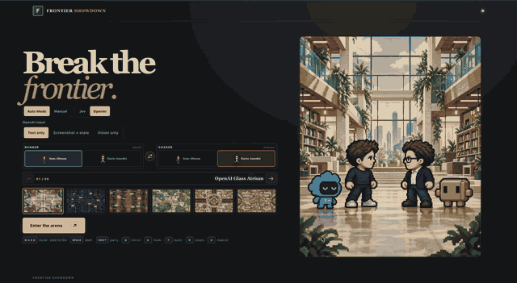
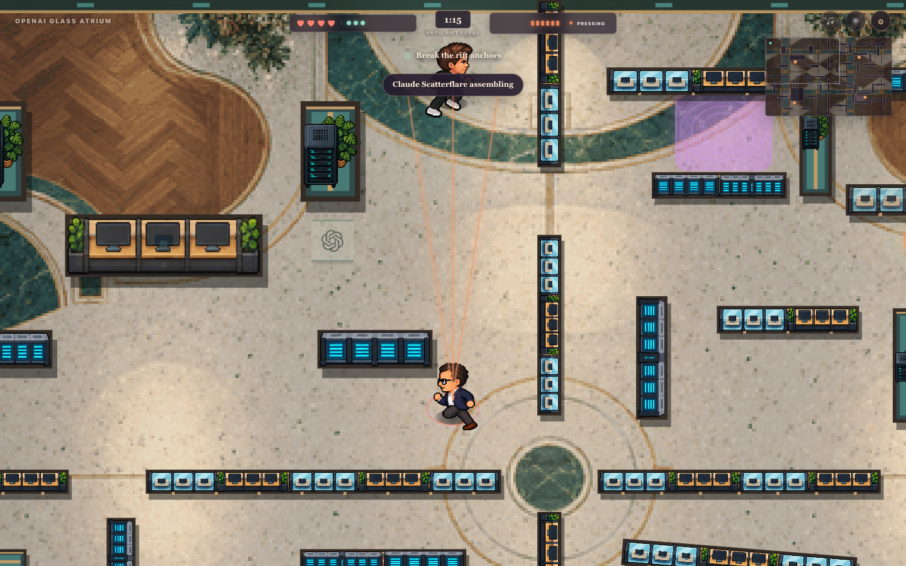
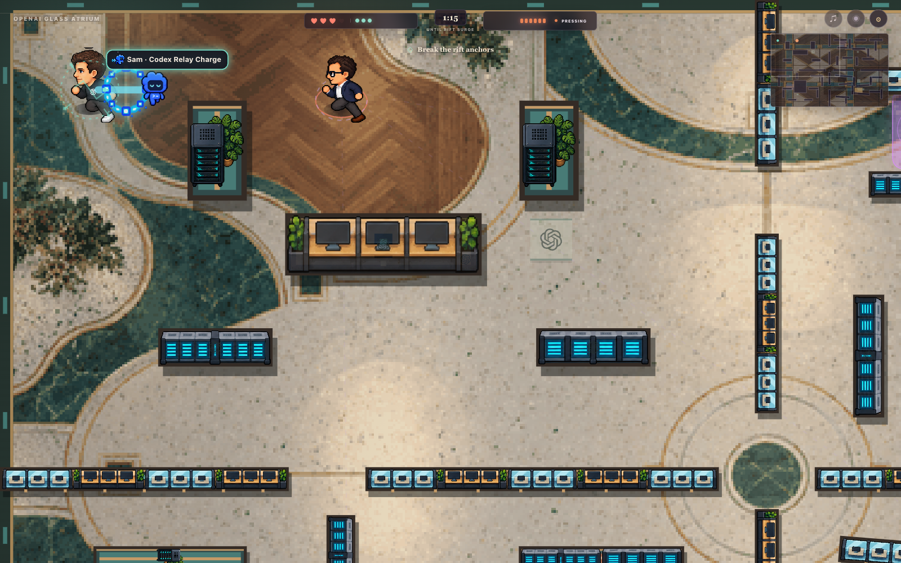

# Frontier Showdown

POV: the office tour went hostile. Pick a runner, pick a chaser, crack three anchors, and settle it across six research-lab arenas. Winner reaches AGI first.

<p align="center">
  
</p>

<p align="center">
  
  
</p>

## Run

Requires Node.js 22+.

```sh
cp .env.example .env
# Configure DECISION_PROVIDER and its API key in .env, then:
npm start
```

The start-page **Choice model** toggle selects Jev or OpenAI for the match. Its initial selection comes from `DECISION_PROVIDER` in `.env`, which defaults to `openai` when unset. The server reads provider keys such as `OPENAI_API_KEY` without exposing them to the browser. `JEV_ENV_FILE` can point to a separate environment file. Open [localhost:4173](http://127.0.0.1:4173). Without a configured provider key, the local tactical fallback still plays.

## Play

The game starts in **Auto Mode**, where the configured decision provider calls the plays for both fighters. Switch to **Manual** to control the runner yourself. Stasis Cast pins you in place while it charges. Mascot Charge sends your lab mascot down a lane to shove the chaser back.

- Move: **WASD** or arrows · Aim/fire: **pointer** or **Z**
- Phase Dash: **Space** · Mirror Echo: **Q** · Rift Hook: **E**
- Lantern Guard: **C** · Soul Burst: **X** · Stasis Cast: **R** · Mascot Charge: **G**

Six arenas: **OpenAI Glass Atrium**, **OpenAI Compute Studio**, **Anthropic Reading Room**, **Anthropic Living Studio**, **Paris AI Action Hall**, and **AI Impact Expo Pavilion**. Pick a map to read its field notes first.
